# DL_LAB1

> 313551133_陳軒宇

## 1. Introduction

在這個 Lab 中，需要實作一個具有 $2$ 層 Hidden Layer 的 Multilayer Perceptron(MLP) ，並實現其 forward, back propagation，以及嘗試不同的 activation function 與 optimizer。

<table width="90%" border="0" cellspacing="0" cellpadding="0">
  <tr>
    <td align="center"> </td>
  </tr>
  <tr>
    <td align="center">MLP</td>
  </tr>
</table>

在建立完成 MLP 後，需要利用給定的 Linear Data 以及 XOR Data 進行訓練，並嘗試不同的訓練設定，以了解各項參數對於模型的影響。

<table width="90%" border="0" cellspacing="0" cellpadding="0">
  <tr>
    <td align="center"> </td>
  </tr>
  <tr>
    <td align="center">Dataset</td>
  </tr>
</table>

## 2. Experiment setups

### A. Sigmoid functions

使用 Sigmoid 函數作為 Activation Function，其函數如下：

$$
\sigma(x) = \frac{1}{1 + e^{-x}}
$$

由於 Sigmoid 函數輸出的範圍在 $[0, 1]$ 之間，因此可以很適合用來作為 Binary Classification 的 Activation Function。

<table width="90%" border="0" cellspacing="0" cellpadding="0">
  <tr>
    <td align="center"> </td>
  </tr>
  <tr>
    <td align="center">Sigmoid</td>
  </tr>
</table>

在訓練過程中，需要對 Activation Function 進行微分，而 Sigmoid 函數的微分如下：

$$
\sigma'(x) = \sigma(x) \cdot (1 - \sigma(x))
$$

在實作時，我定義了一個 `Sigmoid` class，並在其中定義了 `forward` 與 `backward` 函數，分別用來計算 Sigmoid 函數的正向與反向傳播，其他 Activation Function 也是類似的實作方式。

```python
class Sigmoid(Layer):
    def __init__(self):
        super().__init__()
        self.out = None

    def __str__(self) -> str:
        return "Sigmoid"
    
    def forward(self, x: np.ndarray) -> np.ndarray:
        out = 1.0 / (1.0 + np.exp(-x))
        self.out = out
        return out

    def backward(self, dout: np.ndarray) -> np.ndarray:
        dx = dout * (1.0 - self.out) * self.out
        return dx
```

### B. Neural network

使用一個具有多層 Hidden Layer 的 Multilayer Perceptron(MLP) 作為模型，其架構如下：

<table width="90%" border="0" cellspacing="0" cellpadding="0">
  <tr>
    <td align="center">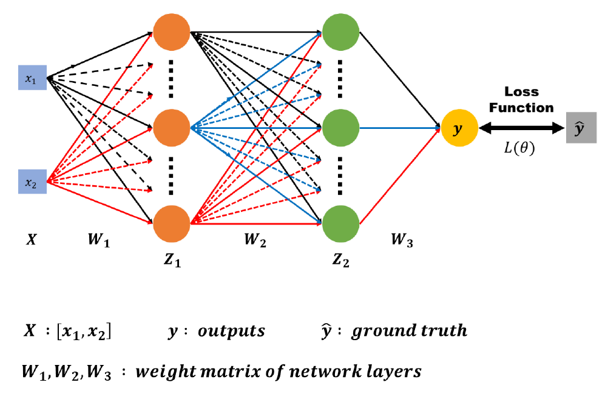 </td>
  </tr>
  <tr>
    <td align="center">Model</td>
  </tr>
</table>

初始化時，需要指定每一層的輸入維度、輸出維度，以及 Activation Function 和 Optimizer，並且可以指定是否使用 Bias (Linear Layer 或 Affine Layer)。

在初始化參數時，使用了 `np.random.randn` 來初始化權重 $W$，並且使用 `np.zeros` 來初始化 Bias $b$，並將這些參數保存在 `params` 中。同時，也使用 `OrderedDict` 來保存每一層的 Layer 使用的 Transformation 和 Activation Function，以便在 Forward 和 Backward 過程中能夠按照順序進行計算。

```python
class MLP(Model):
    def __init__(self, input_size: int, hidden_size: List[int], output_size: int, 
                 lr: float=0.01, optimizer: Optimizer=SGD, layer: Layer=Affine, activation: Layer=Sigmoid):
        super().__init__()
        self.input_size = input_size
        self.hidden_size = hidden_size
        self.output_size = output_size

        self.lr = lr
        self.optimizer = optimizer(lr)
        self.layer = layer
        self.activation = activation

        self.params = {}
        for i, (x, y) in enumerate(pairwise([input_size] + hidden_size + [output_size]), 1):
            self.params['W'+str(i)] = np.random.randn(x, y)
            self.params['b'+str(i)] = np.zeros(y)
        
        self.layers = OrderedDict()
        for i in range(1, len(hidden_size) + 2):
            self.layers[f'Layer{i}'] = self.layer(self.params[f'W{i}'], self.params[f'b{i}'])
            self.layers[f'Activation{i}'] = activation()
```

在本次 Lab 中，我使用了 $2$ 層具有 $10$ 個 Hidden Unit 的 Hidden Layer，並且使用 Sigmoid 函數作為 Activation Function、使用 SGD 作為 Optimizer。

```python
model = MLP(input_size=2, hidden_size=[10, 10], output_size=1,
            lr=0.01, optimizer=SGD, activation=Sigmoid)
```

### C. Backpropagation

在 Forward 過程中，需要將輸入 $x$ 進行 Linear Transformation ，但由於這裡加上了 Bias，因此應為 Affine Transformation。將 Transformation 後的輸出進行 Activation Function 的計算，得到輸出 $y$。

單一層 Affine Layer 的 Forward 過程如下，圖片中的形狀大小為 $3$ 的部分在本次 Lab 中為 $10$：

<table width="100%" border="0" cellspacing="0" cellpadding="0">
  <tr>
    <td align="center">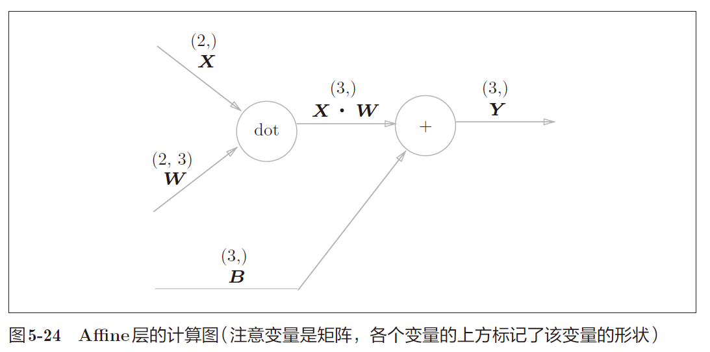 </td>
  </tr>
  <tr>
    <td align="center">Affine Layer</td>
  </tr>
</table>

因此整個 Network 的 Forward 過程如下：

$$
z_1 = \sigma(xW_1 + b_1) \\
z_2 = \sigma(z_1W_2 + b_2) \\
y = \sigma(z_2W_3 + b_3)
$$

根據模型的輸出 $y$ 和真實的標籤 $\hat{y}$ 之間的差距，可以計算出 Loss Function $L$，這裡使用了 Mean Squared Error(MSE) 作為 Loss Function。

$$
L = \frac{1}{n} \sum_{i=1}^{n} (y_i - \hat{y}_i)^2
$$

在計算完 loss function 後，需要使用 Backpropagation 來更新模型的權重，因此需要使用 Chain Rule 來計算 $\frac{\partial L}{\partial W_1}$、$\frac{\partial L}{\partial W_2}$、$\frac{\partial L}{\partial W_3}$ 以及 $\frac{\partial L}{\partial b_1}$、$\frac{\partial L}{\partial b_2}$、$\frac{\partial L}{\partial b_3}$。

<table width="90%" border="0" cellspacing="0" cellpadding="0">
  <tr>
    <td align="center">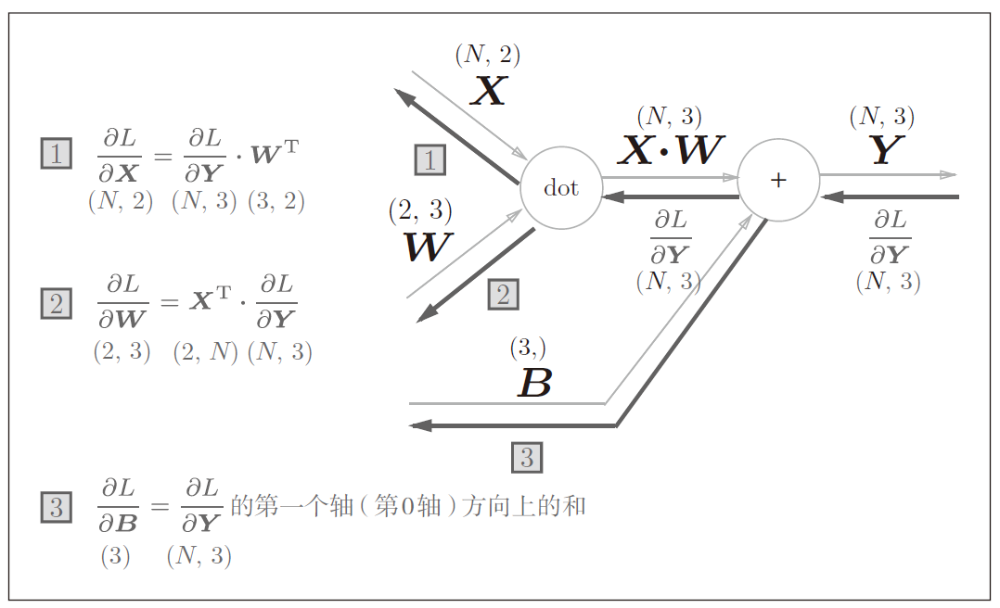</td>
  </tr>
  <tr>
    <td align="center">Affine Layer 的 Backpropagation 計算</td>
  </tr>
</table>

程式碼實現如下，其中 $dout$ 為 $\frac{\partial L}{\partial y}$，$dx$ 為 $\frac{\partial L}{\partial x}$，$dW$ 為 $\frac{\partial L}{\partial W}$，$db$ 為 $\frac{\partial L}{\partial b}$。

```python
class Affine(Layer):
    def forward(self, x: np.ndarray) -> np.ndarray:
        self.x = x
        out = np.dot(x, self.W) + self.b
        return out

    def backward(self, dout: np.ndarray) -> np.ndarray:
        dx = np.dot(dout, self.W.T)
        self.dW = np.dot(self.x.T, dout)
        self.db = np.sum(dout, axis=0)
        return dx
```

注意到不管是在 `Affine` Layer 還是在 `Sigmoid` Layer 中，都需要保存一些中間過程的變數，以便在 Backward 過程中使用。將這些變數保存在 attribute 中，這樣在 Backward 過程中就可以直接呼叫 `backward` 函數，而不需要再傳入前一層的梯度以外的參數。

```python
    def forward(self, x):
        for layer in self.layers.values():
            x = layer.forward(x)
        self.pred_y = x
        return x
    
    def backward(self, y):
        dout = y
        for layer in reversed(self.layers.values()):
            dout = layer.backward(dout)
        return dout
```

## 3. Results of your testing

### A. Screenshot and comparison figure

<table width="100%" border="0" cellspacing="0" cellpadding="0">
  <tr>
    <td align="center">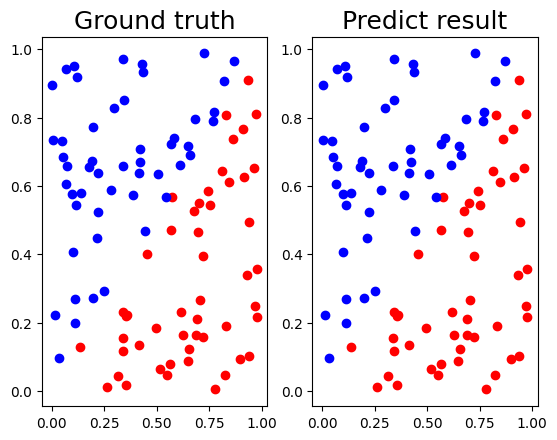</td>
    <td align="center">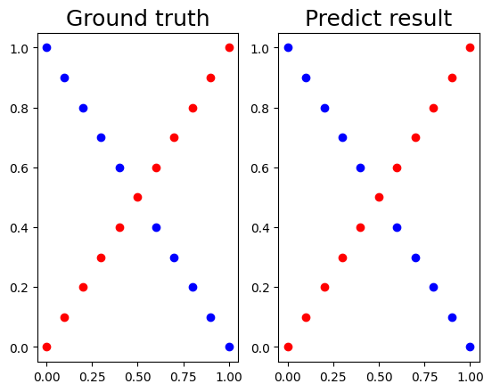</td>
    
  </tr>
  <tr>
    <td align="center">Linear Dataset</td>
    <td align="center">XOR Dataset</td>
  </tr>
</table>

### B. Show the accuracy of your prediction

#### Linear Data

loss:

```text
epoch  1000 loss : 0.07849912063132942
epoch  2000 loss : 0.04520821461964975
epoch  3000 loss : 0.03313976789135106
epoch  4000 loss : 0.026940282327582377
epoch  5000 loss : 0.0231676558935124
epoch  6000 loss : 0.020597469744500184
epoch  7000 loss : 0.018696248300644046
epoch  8000 loss : 0.0172013349710097
epoch  9000 loss : 0.01597140118800952
epoch 10000 loss : 0.014924860070591127
epoch 11000 loss : 0.014011814589522444
epoch 12000 loss : 0.013200238163389779
epoch 13000 loss : 0.01246870731690159
epoch 14000 loss : 0.011802361939324704
epoch 15000 loss : 0.011190551366477411
epoch 16000 loss : 0.010625407146434231
epoch 17000 loss : 0.010100948298129709
epoch 18000 loss : 0.009612504451975824
epoch 19000 loss : 0.009156335033611893
epoch 20000 loss : 0.008729372736693393
```

prediction:

```text
Iter: 0 |	 Ground truth: [1] |	 Predict: [1]
Iter: 1 |	 Ground truth: [0] |	 Predict: [0]
Iter: 2 |	 Ground truth: [0] |	 Predict: [0]
Iter: 3 |	 Ground truth: [0] |	 Predict: [0]
Iter: 4 |	 Ground truth: [1] |	 Predict: [1]
Iter: 5 |	 Ground truth: [0] |	 Predict: [0]
Iter: 6 |	 Ground truth: [0] |	 Predict: [0]
Iter: 7 |	 Ground truth: [1] |	 Predict: [1]
Iter: 8 |	 Ground truth: [0] |	 Predict: [0]
Iter: 9 |	 Ground truth: [1] |	 Predict: [1]
Iter: 10 |	 Ground truth: [1] |	 Predict: [1]
Iter: 11 |	 Ground truth: [0] |	 Predict: [0]
Iter: 12 |	 Ground truth: [0] |	 Predict: [0]
Iter: 13 |	 Ground truth: [0] |	 Predict: [0]
Iter: 14 |	 Ground truth: [1] |	 Predict: [1]
Iter: 15 |	 Ground truth: [1] |	 Predict: [1]
Iter: 16 |	 Ground truth: [1] |	 Predict: [1]
Iter: 17 |	 Ground truth: [1] |	 Predict: [1]
Iter: 18 |	 Ground truth: [1] |	 Predict: [1]
Iter: 19 |	 Ground truth: [0] |	 Predict: [0]
Iter: 20 |	 Ground truth: [1] |	 Predict: [1]
Iter: 21 |	 Ground truth: [1] |	 Predict: [1]
Iter: 22 |	 Ground truth: [0] |	 Predict: [0]
Iter: 23 |	 Ground truth: [1] |	 Predict: [1]
Iter: 24 |	 Ground truth: [0] |	 Predict: [0]
Iter: 25 |	 Ground truth: [0] |	 Predict: [0]
Iter: 26 |	 Ground truth: [0] |	 Predict: [0]
Iter: 27 |	 Ground truth: [0] |	 Predict: [0]
Iter: 28 |	 Ground truth: [1] |	 Predict: [1]
Iter: 29 |	 Ground truth: [0] |	 Predict: [0]
Iter: 30 |	 Ground truth: [1] |	 Predict: [1]
Iter: 31 |	 Ground truth: [1] |	 Predict: [1]
Iter: 32 |	 Ground truth: [0] |	 Predict: [0]
Iter: 33 |	 Ground truth: [1] |	 Predict: [1]
Iter: 34 |	 Ground truth: [1] |	 Predict: [1]
Iter: 35 |	 Ground truth: [1] |	 Predict: [1]
Iter: 36 |	 Ground truth: [0] |	 Predict: [0]
Iter: 37 |	 Ground truth: [0] |	 Predict: [0]
Iter: 38 |	 Ground truth: [1] |	 Predict: [1]
Iter: 39 |	 Ground truth: [1] |	 Predict: [1]
Iter: 40 |	 Ground truth: [1] |	 Predict: [1]
Iter: 41 |	 Ground truth: [0] |	 Predict: [0]
Iter: 42 |	 Ground truth: [1] |	 Predict: [1]
Iter: 43 |	 Ground truth: [0] |	 Predict: [0]
Iter: 44 |	 Ground truth: [1] |	 Predict: [1]
Iter: 45 |	 Ground truth: [0] |	 Predict: [0]
Iter: 46 |	 Ground truth: [0] |	 Predict: [0]
Iter: 47 |	 Ground truth: [0] |	 Predict: [0]
Iter: 48 |	 Ground truth: [0] |	 Predict: [0]
Iter: 49 |	 Ground truth: [0] |	 Predict: [0]
Iter: 50 |	 Ground truth: [1] |	 Predict: [1]
Iter: 51 |	 Ground truth: [0] |	 Predict: [0]
Iter: 52 |	 Ground truth: [1] |	 Predict: [1]
Iter: 53 |	 Ground truth: [1] |	 Predict: [1]
Iter: 54 |	 Ground truth: [0] |	 Predict: [0]
Iter: 55 |	 Ground truth: [1] |	 Predict: [1]
Iter: 56 |	 Ground truth: [1] |	 Predict: [1]
Iter: 57 |	 Ground truth: [1] |	 Predict: [1]
Iter: 58 |	 Ground truth: [0] |	 Predict: [0]
Iter: 59 |	 Ground truth: [1] |	 Predict: [1]
Iter: 60 |	 Ground truth: [1] |	 Predict: [1]
Iter: 61 |	 Ground truth: [1] |	 Predict: [1]
Iter: 62 |	 Ground truth: [1] |	 Predict: [1]
Iter: 63 |	 Ground truth: [1] |	 Predict: [1]
Iter: 64 |	 Ground truth: [0] |	 Predict: [0]
Iter: 65 |	 Ground truth: [0] |	 Predict: [0]
Iter: 66 |	 Ground truth: [0] |	 Predict: [0]
Iter: 67 |	 Ground truth: [1] |	 Predict: [1]
Iter: 68 |	 Ground truth: [1] |	 Predict: [1]
Iter: 69 |	 Ground truth: [1] |	 Predict: [1]
Iter: 70 |	 Ground truth: [1] |	 Predict: [1]
Iter: 71 |	 Ground truth: [0] |	 Predict: [0]
Iter: 72 |	 Ground truth: [1] |	 Predict: [1]
Iter: 73 |	 Ground truth: [1] |	 Predict: [1]
Iter: 74 |	 Ground truth: [0] |	 Predict: [0]
Iter: 75 |	 Ground truth: [0] |	 Predict: [0]
Iter: 76 |	 Ground truth: [0] |	 Predict: [0]
Iter: 77 |	 Ground truth: [0] |	 Predict: [0]
Iter: 78 |	 Ground truth: [1] |	 Predict: [1]
Iter: 79 |	 Ground truth: [0] |	 Predict: [0]
Iter: 80 |	 Ground truth: [0] |	 Predict: [0]
Iter: 81 |	 Ground truth: [0] |	 Predict: [0]
Iter: 82 |	 Ground truth: [1] |	 Predict: [1]
Iter: 83 |	 Ground truth: [0] |	 Predict: [0]
Iter: 84 |	 Ground truth: [0] |	 Predict: [0]
Iter: 85 |	 Ground truth: [1] |	 Predict: [1]
Iter: 86 |	 Ground truth: [1] |	 Predict: [1]
Iter: 87 |	 Ground truth: [1] |	 Predict: [1]
Iter: 88 |	 Ground truth: [1] |	 Predict: [1]
Iter: 89 |	 Ground truth: [1] |	 Predict: [1]
Iter: 90 |	 Ground truth: [0] |	 Predict: [0]
Iter: 91 |	 Ground truth: [0] |	 Predict: [0]
Iter: 92 |	 Ground truth: [0] |	 Predict: [0]
Iter: 93 |	 Ground truth: [1] |	 Predict: [1]
Iter: 94 |	 Ground truth: [0] |	 Predict: [0]
Iter: 95 |	 Ground truth: [1] |	 Predict: [1]
Iter: 96 |	 Ground truth: [0] |	 Predict: [0]
Iter: 97 |	 Ground truth: [0] |	 Predict: [0]
Iter: 98 |	 Ground truth: [0] |	 Predict: [0]
Iter: 99 |	 Ground truth: [0] |	 Predict: [0]
loss=0.00873 accuracy=100.00%
```

#### XOR Data

loss:

```text
epoch  1000 loss : 0.2507043488190884
epoch  2000 loss : 0.24827133390907646
epoch  3000 loss : 0.24530348812303807
epoch  4000 loss : 0.2402814733403033
epoch  5000 loss : 0.23052597643483982
epoch  6000 loss : 0.21082976053330493
epoch  7000 loss : 0.1749271050808638
epoch  8000 loss : 0.12385950082031297
epoch  9000 loss : 0.0832229156422266
epoch 10000 loss : 0.05890902645016745
epoch 11000 loss : 0.04323208060886581
epoch 12000 loss : 0.03235669038687363
epoch 13000 loss : 0.024545998062900892
epoch 14000 loss : 0.01887006239216881
epoch 15000 loss : 0.014738278931597995
epoch 16000 loss : 0.011720456712043657
epoch 17000 loss : 0.009496796793265413
epoch 18000 loss : 0.007836141129906608
epoch 19000 loss : 0.0065758111998092195
epoch 20000 loss : 0.005602855922810573
```

prediction:

```text
Iter: 0 |	 Ground truth: [0] |	 Predict: [0]
Iter: 1 |	 Ground truth: [1] |	 Predict: [1]
Iter: 2 |	 Ground truth: [0] |	 Predict: [0]
Iter: 3 |	 Ground truth: [1] |	 Predict: [1]
Iter: 4 |	 Ground truth: [0] |	 Predict: [0]
Iter: 5 |	 Ground truth: [1] |	 Predict: [1]
Iter: 6 |	 Ground truth: [0] |	 Predict: [0]
Iter: 7 |	 Ground truth: [1] |	 Predict: [1]
Iter: 8 |	 Ground truth: [0] |	 Predict: [0]
Iter: 9 |	 Ground truth: [1] |	 Predict: [1]
Iter: 10 |	 Ground truth: [0] |	 Predict: [0]
Iter: 11 |	 Ground truth: [0] |	 Predict: [0]
Iter: 12 |	 Ground truth: [1] |	 Predict: [1]
Iter: 13 |	 Ground truth: [0] |	 Predict: [0]
Iter: 14 |	 Ground truth: [1] |	 Predict: [1]
Iter: 15 |	 Ground truth: [0] |	 Predict: [0]
Iter: 16 |	 Ground truth: [1] |	 Predict: [1]
Iter: 17 |	 Ground truth: [0] |	 Predict: [0]
Iter: 18 |	 Ground truth: [1] |	 Predict: [1]
Iter: 19 |	 Ground truth: [0] |	 Predict: [0]
Iter: 20 |	 Ground truth: [1] |	 Predict: [1]
loss=0.00560 accuracy=100.00%
```

### C. Learning curve (loss, epoch curve)

<table width="100%" border="0" cellspacing="0" cellpadding="0">
  <tr>
    <td align="center">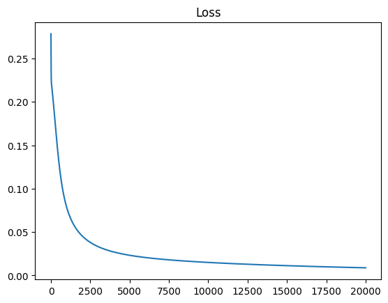</td>
    <td align="center">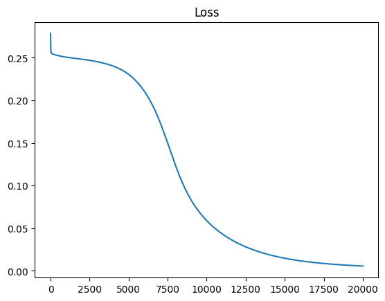</td>
    
  </tr>
  <tr>
    <td align="center">Linear Dataset</td>
    <td align="center">XOR Dataset</td>
  </tr>
</table>


### D. Anything you want to present

- 在 Backpropagation 過程中，若使用 $(y - \hat{y})$ 作為 Loss Function 的梯度，則在使用 Sigmoid 函數作為 Activation Function 時，會訓練的比較快，但在不使用 Activation Function 時，則無法訓練成功。若取 $\frac{2 \times (y - \hat{y})}{n}$ 作為 Loss Function 的梯度，則在大部分的情況下，都可以訓練成功，但在以 Sigmoid 函數作為 Activation Function 時，需要相對較多的 Epochs。

## 4. Discussion

### A. Try different learning rates

Parameters: 
- hidden layer size = [10, 10]
- optimizer = SGD
- activation function = Sigmoid

| lr   | epochs | Linear | XOR    |
|------|--------|--------|--------|
| 1    | 10000  | 100%   | 100%   |
| 0.5  | 10000  | 100%   | 100%   |
| 0.1  | 10000  | 100%   | 95.24% |
| 0.1  | 20000  | 100%   | 100%   |
| 0.05 | 10000  | 98%    | 71.43% |
| 0.05 | 50000  | 100%   | 100%   |
| 0.01 | 20000  | 98%    | 52.38% |
| 0.01 | 50000  | 98%    | 71.43% |

可以觀察到，在 Learning Rate 大時，模型的收斂速度較快，在 Learning Rate 小時，需要更多的 Epochs。此外，在 Learning Rate 過小時，也有可能會無法到達最佳解的位置。

### B. Try different numbers of hidden units

| hiddens   | epochs | Linear | XOR    |
|-----------|--------|--------|--------|
| [20,  20] | 20000  | 100%   | 100%   |
| [5, 5]    | 20000  | 100%   | 85.71% |
| [5, 5]    | 50000  | 100%   | 100%   |
| [2, 2]    | 20000  | 100%   | 71.43% |
| [2, 2]    | 50000  | 100%   | 100%   |

可以觀察到，當 Hidden Layer 太小時，模型無法很好的學習到 XOR Data 的特徵，但在增加 Epochs 後，仍然可以達到 100% 的準確率。

### C. Try without activation functions

移除 Activation Function 後，部分的程式碼如下：

```python
self.params = {}
for i, (x, y) in enumerate(pairwise([input_size] + hidden_size + [output_size]), 1):
    self.params['W'+str(i)] = np.random.randn(x, y)
    self.params['b'+str(i)] = np.zeros(y)

self.layers = OrderedDict()
for i in range(1, len(hidden_size) + 2):
    self.layers[f'Layer{i}'] = self.layer(self.params[f'W{i}'], self.params[f'b{i}'])
```

Parameters: 
- hidden layer size = [5, 5]
- learning rate = 0.01
- optimizer = SGD
- activation function = Sigmoid
- epochs = 20000

<table width="90%" border="0" cellspacing="0" cellpadding="0">
  <tr>
    <td align="center"></td>
    <td align="center">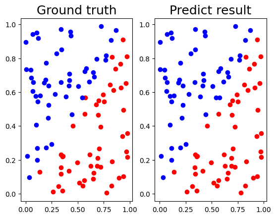</td>
  </tr>
  <tr>
    <td align="center">Loss of Linear dataset</td>
    <td align="center">Result of Linear dataset (99.00%) </td>
  </tr>
  <tr>
    <td align="center">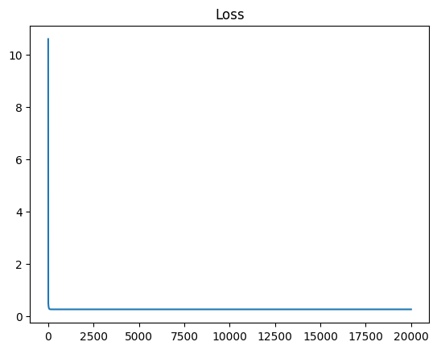</td>
    <td align="center">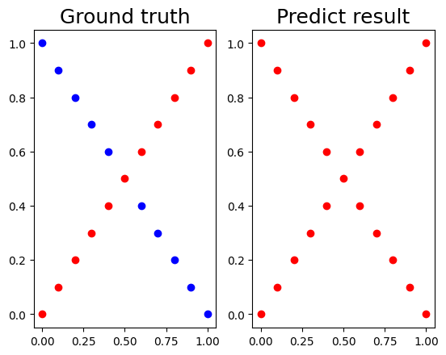</td>
  </tr>
  <tr>
    <td align="center">Loss of XOR dataset</td>
    <td align="center">Result of XOR dataset (52.38%) </td>
  </tr>
</table>

若不使用 Activation Function，則不管使用多少層 Hidden Layer，都仍然只是一個線性模型，無法學習到 XOR Data 的特徵。

# 5. Extra

### A. Implement different optimizers

除了使用 SGD 作為 Optimizer 外，我也實作了 AdaGrad 。

AdaGrad 的更新公式如下：

$$
h \leftarrow h + \nabla L \odot \nabla L \\
W \leftarrow W - \frac{\eta}{\sqrt{h + \epsilon}} \odot \nabla L
$$

其中 $h$ 為一個和 $W$ 同樣大小的矩陣，用來保存過去的梯度的平方和，$\eta$ 為 Learning Rate，$\epsilon$ 為一個很小的數值，用來避免分母為 $0$。

<table width="90%" border="0" cellspacing="0" cellpadding="0">
  <tr>
    <td align="center">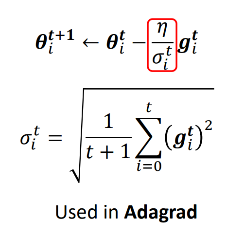</td>
  </tr>
  <tr>
    <td align="center">from NTU ML2021</td>
  </tr>
</table>


部分的程式碼如下：

```python
class AdaGrad(Optimizer):
    def __init__(self, lr: float=0.01):
        self.lr = lr
        self.eps = 1e-7 # term added to the denominator to improve numerical stability
        self.h = None

    def update(self, params: Dict[str, np.ndarray], grads: Dict[str, np.ndarray]):
        if self.h is None:
            self.h = {}
            for key, val in params.items():
                self.h[key] = np.zeros_like(val)
        
        for key in params.keys():
            self.h[key] += grads[key] ** 2
            params[key] -= self.lr * grads[key] / (np.sqrt(self.h[key]) + self.eps)
        return params
```

Parameters: 
- hidden layer size = [10, 10]
- activation function = Sigmoid

| optimizer | lr   | epochs | Linear | XOR    |
|-----------|------|--------|--------|--------|
| AdaGrad   | 0.1  | 10000  | 100%   | 100%   |
| SGD       | 0.1  | 10000  | 100%   | 95.24% |
| AdaGrad   | 0.01 | 10000  | 99%    | 100%   |
| SGD       | 0.01 | 20000  | 98%    | 52.38% |

可以觀察到，AdaGrad 需要的 Epochs 較少，且在 XOR Data 上的表現也較好。

### B. Implement different activation functions

#### ReLU

ReLU 函數的公式如下：

$$
\text{ReLU}(x) = \max(0, x)
$$

其微分如下：

$$
\text{ReLU}'(x) = \begin{cases}
1 & \text{if } x > 0 \\
0 & \text{otherwise}
\end{cases}
$$

```python
class ReLU(Layer):
    def forward(self, x: np.ndarray) -> np.ndarray:
        self.mask = (x <= 0)
        out = x.copy()
        out[self.mask] = 0
        return out
    
    def backward(self, dout: np.ndarray) -> np.ndarray:
        dout[self.mask] = 0 # set non-positive elements to 0
        dx = dout
        return dx
```

Parameters: 
- hidden layer size = [10, 10]
- learning rate = 0.01
- optimizer = SGD
- activation function = ReLU
- epochs = 10000

Results:
- Linear dataset: 100%
- XOR dataset: 100%

#### Tanh

TanH 函數的公式如下：

$$
\text{Tanh}(x) = \frac{e^x - e^{-x}}{e^x + e^{-x}}
$$

其微分如下：

$$
\text{Tanh}'(x) = 1 - \text{Tanh}^2(x)
$$

```python
class Tanh(Layer):
    def forward(self, x: np.ndarray) -> np.ndarray:
        out = np.tanh(x)
        self.out = out
        return out

    def backward(self, dout: np.ndarray) -> np.ndarray:
        dx = dout * (1 - self.out ** 2)
        return dx
```

Parameters: 
- hidden layer size = [10, 10]
- learning rate = 0.01
- optimizer = SGD
- activation function = ReLU
- epochs = 10000

Results:
- Linear dataset: 98%
- XOR dataset: 100%

<style>
    img {
        max-height: 400px;
        max-width: 90%;
        height: auto;
        width: auto;
    }
</style>